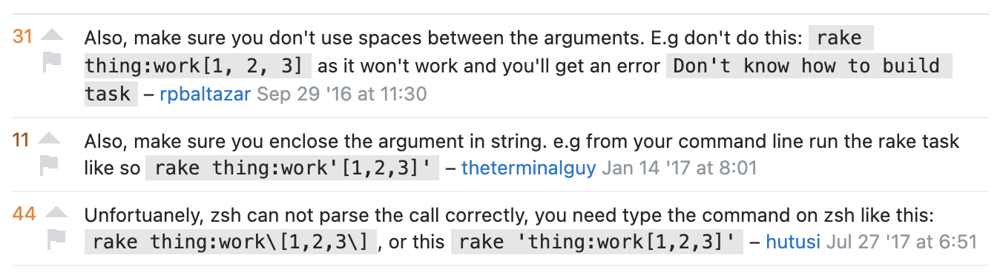

# 👌 `ok`

A task runner.

## Usage

Given an `Okfile` written in any [supported language/tool](#currently-supported-languagestools):
```ruby
# Okfile.rb

def example(apple, banana = 'yellow', cherry:, durian: 'smelly')
    puts "#{apple} apple, #{banana} banana, #{cherry} cherry, #{durian} durian"
end
```

You can use `ok` to call methods directly from the command line:
```shell
$ ok example 'granny smith' --durian stinky -c maraschino
granny smith apple, yellow banana, maraschino cherry, stinky durian
```

You can also run `ok` without a task name to list available tasks:
```shell
$ ok
build                                                     Makefile   make
example <apple> <banana=yellow> --cherry --durian=smelly  Okfile.rb  ruby
generate                                                  Makefile   make
get <url>                                                 Okfile.go  go
greet <name=World>                                        Okfile.rb  ruby
list                                                      Okfile.go  go
types                                                     Okfile.go  go
```

## Why?

This tool aims to do these things:
1. Make it easy to be able to do rapid local testing for specific programming languages.
2. Provide certain task runners with a better CLI.
3. Aggregate tasks from several sources.

### Rapid Local Testing

I mostly work in Ruby, Go, and JS, and find that occasionally I just want to write a short method to try something out.
Maybe hit an API endpoint, or just see the output of a function. Or even, like in this project, detect Go import groups
with multiple double newlines (see `ugly_imports` in `Okfile.rb`). Then again, I guess that's the whole point of a
task runner in the first place, so maybe this is goal is redundant? ¯\_(ツ)_/¯

### Improved Task CLIs

This is mostly a dig at Rake, but in general, a lot of task runners don't seem to offer a good way (if any) to pass in 
arguments.

Seriously though, why does Rake ask for square brackets to pass in arguments to tasks? Hugely inconvenient.


To demonstrate, given Rake task:
```ruby
desc 'some task'
task :things, [:arg_a, :arg_b] => :environment do |t, args|
    arg_a, arg_b = args.values_at(:arg_a, :arg_b)
    puts arg_a, arg_b
end
```

invoking with rake looks like this:
```shell
$ rake 'things[aye,bee]'
```

now, with `ok`:
```shell
$ ok things aye bee
```

### Aggregate tasks from several places

This one actually breaks down a bit further into two points:
1. I think it's cool/useful to be able to see all of your tasks in the same place.
2. I've noticed Makefiles in use a lot, and there's no easy way to list rules in a Makefile, so this tool is _at least_
good for that (hopefully).

## Installation

### Brew

```shell
$ brew tap broothie/ok && brew install ok
```

### Via Go

```shell
$ go install github.com/broothie/ok/cmd/ok/ok.go@latest
```

### Releases

Releases can be found on the [releases page](https://github.com/broothie/okay/releases).

## Currently Supported Languages/Tools
- Go
- Make
- Ruby
- Rake
- Python
- Node
- zsh
- bash
- docker-compose
- Yarn

## To Do

[To Do tracker](https://github.com/broothie/ok/projects/1)
